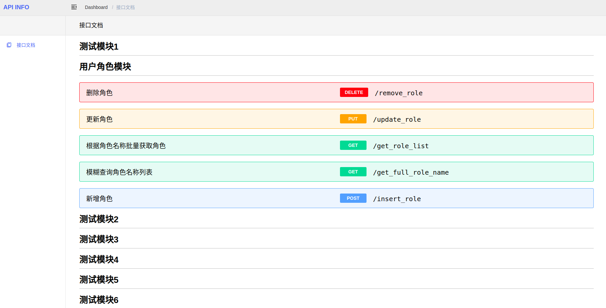

# Spring 项目文档自动生成

在springweb项目中引用本项目，结合注解，可以自动生成接口文档，每个接口信息支持自定义。

本项目自带一个UI，使用vue编写。

## Quick Start

**引入项目**

在目标项目中引入本项目：

```xml

<dependency>
    <groupId>fit.wenchao</groupId>
    <artifactId>api-docs</artifactId>
    <version>0.0.1-SNAPSHOT</version>
</dependency>
```

**在目标项目中使用注解写文档**

```java

@ApiModule(moduleName = "测试模块")
@RestController
public class TestController {

    @ApiDescription(name = "测试接口", detail = "本接口用于测试")
    @ApiParameters(params = {
            @ApiParameter(paramType = ApiParamType.QUERY, name = "param1",
                    defaultValue = "1", required = false),
            @ApiParameter(paramType = ApiParamType.QUERY, name = "param2",
                    defaultValue = "2", required = true),
    })
    @GetMapping("/test-api")
    public Object testApi(String param1, String param2) {
        //...
        return new Object();
    }

}
```

**启动目标项目**

启动目标项目

**打开本项目前端**

```shell

git clone https://github.com/Aaron-srider/spring-api-doc

cd ./api-docs/UI/api-doc

npm install

vi .env.development
# 修改目标项目的host和port

npm run dev
```

**Demo**



## 自定义返回接口信息

本项目默认返回接口的信息，包括模块名、接口url、接口参数信息等。如果这些信息不能满足需求，本项目也支持自定义接口信息。

**在目标项目中扩展插件**

实现 ApiInfoPlugin 接口，并将其放入IOC容器中，示例如下：

```java

@Component
class AddApiTagApiInfoPlugin implements ApiInfoPlugin {
    CustomApiInfo getInfo(Method method, ApiInfoContext apiInfoContext) {
        String apiTag = apiInfoContext.getHttpMethod()
                + "-"
                + apiInfoContext.getUrl();

        return new CustomApiInfo() {
            public Object getInfoSignature() {
                return "api_tag";
            }

            public Object getInfoBody() {
                return apiTag;
            }
        };
    }
}
```

通常来说，你可以在Controller的方法上写自定义的注解，并从 method 参数中获取注解中的信息，这也是本项目已有代码的大致逻辑。另外，你可以从 ApiInfoContext
中获取api的基础数据，比如url，name，这些数据是本项目在调用用户自定义插件前解析好的。

上述实例中，返回的每个Api数据中会多出“api_tag”数据。通常来说，你还需要为这部分自定义的数据修改前端代码，以展示数据。
